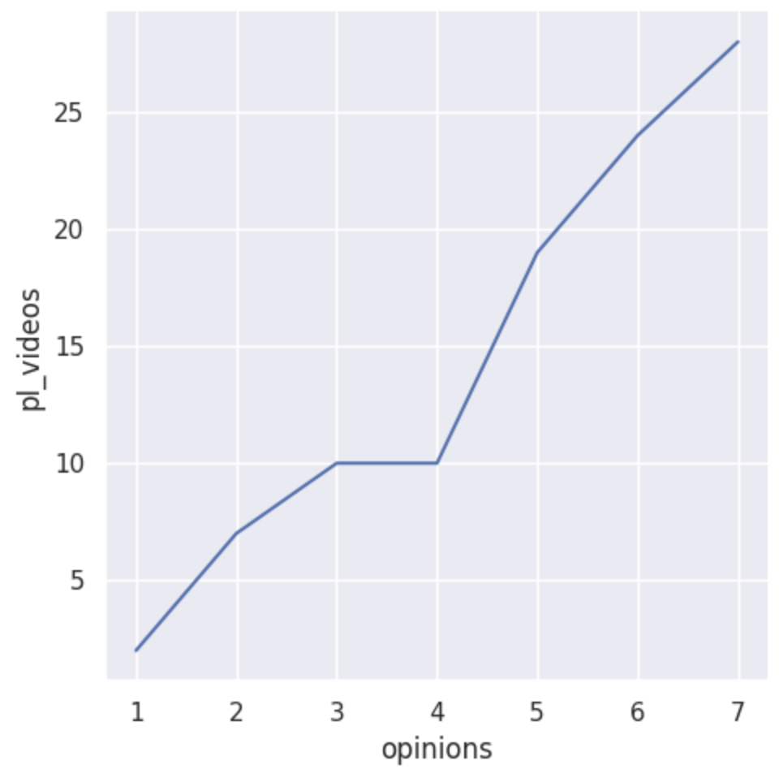
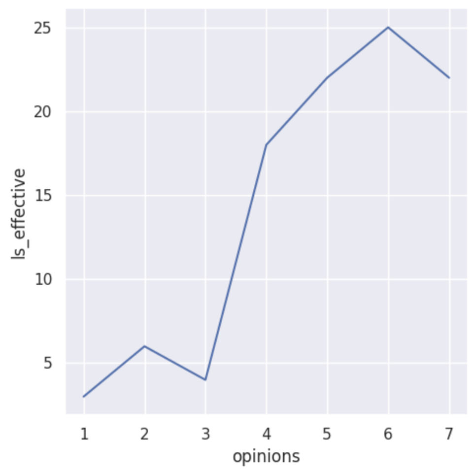
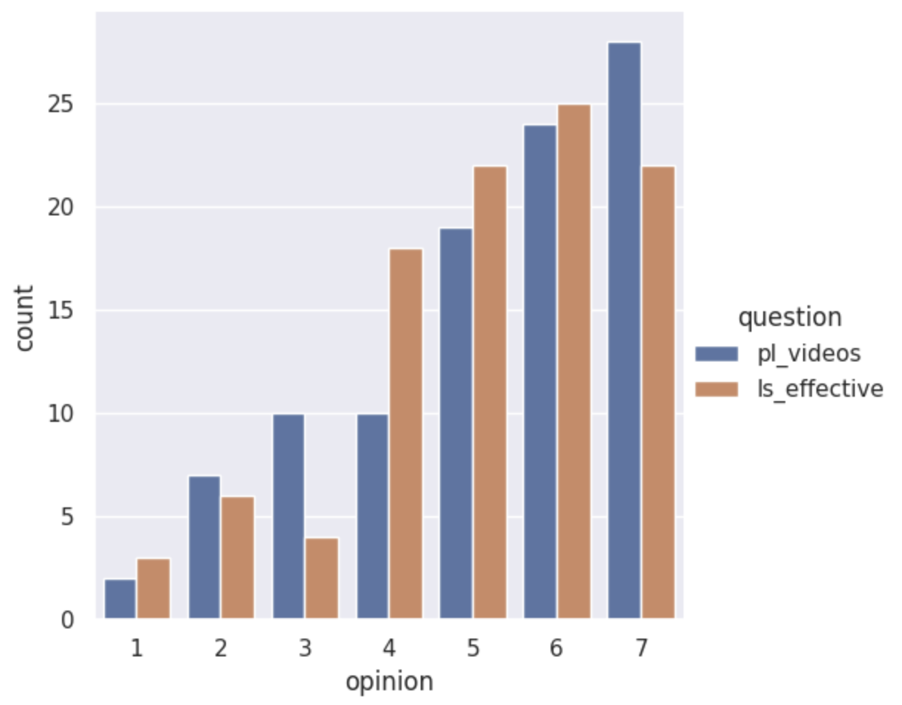

---
# Do not edit the text between these lines!
layout: default
---

# COMP 110 EX 09 - Alex Lugones

<!-- This is a comment. Below, you'll see code for inserting an image. To make this image appear, update <custom-path>. To add an image, save it inside the imgs folder of this repository. -->

## Analysis

My analysis of the data does support my idea, thus meaning that having at least one video lesson posted for every class will be beneficial because it will help better explain concepts for students who have to miss class. I recommend that at least one video lesson is posted that is either recorded during class or used from a previous semester.

I chose to analyze the responses to two questions asked on the survey. The first was converted into variable pre_lecture_videos. It is described by the COMP 110 instructors as: Student believes that optional pre-lecture videos that prepare students for the content of each lecture would be helpful for their learning. Possible values (1 being Strongly Disagree and 7 being Strongly Agree): 1, 2, 3, 4, 5, 6, 7. I chose this because it directly relates to my idea that video lessons correlate with a better explanation.

The second question was converted into variable ls_effective. It is described by the COMP 110 instructors as: Lesson videos are effective in helping student learn the topics of the course. Possible values (1 being Strongly Disagree and 7 being Strongly Agree): 1, 2, 3, 4, 5, 6, 7. I chose this because it also relates to my idea that video lessons correlate with a better comprehension of the material.

The results I found related to overwhelmingly positive opinions on both variables supporting that video lessons would be helpful. Scores above 5 were more common than scores below 4.

The potential cost would come to the instructors. If they did not have a prerecorded video, they would have to film their lecture or record a new lecture. Filming lectures can be technologically difficult, especially in regards of switching between computer and tablet for memory diagrams. If a recording is corrupted, it can be extremely time consuming to record a new one.

